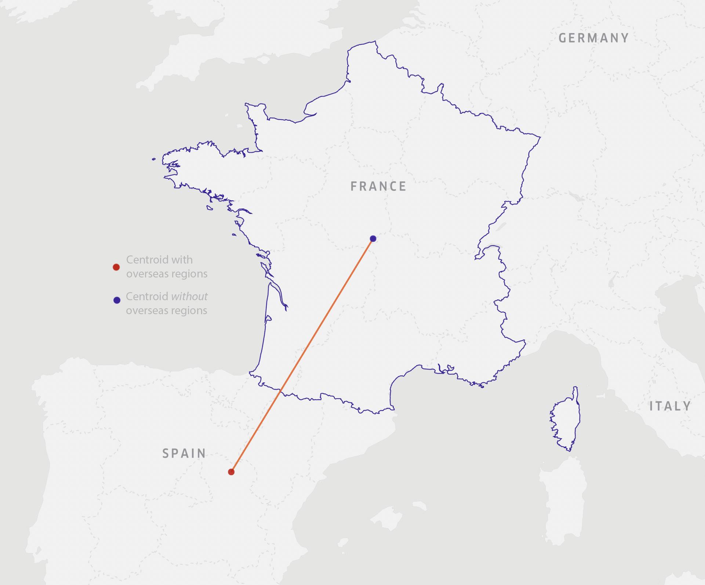
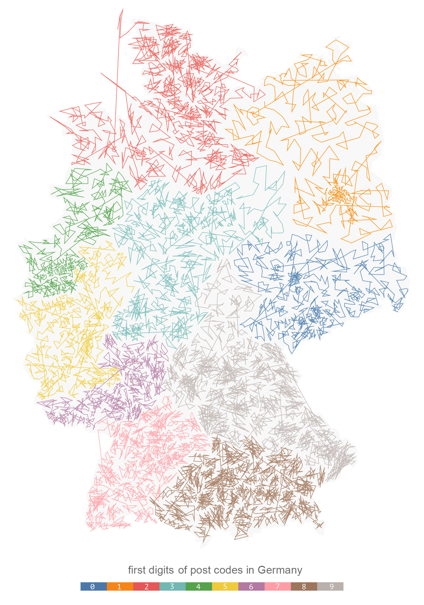
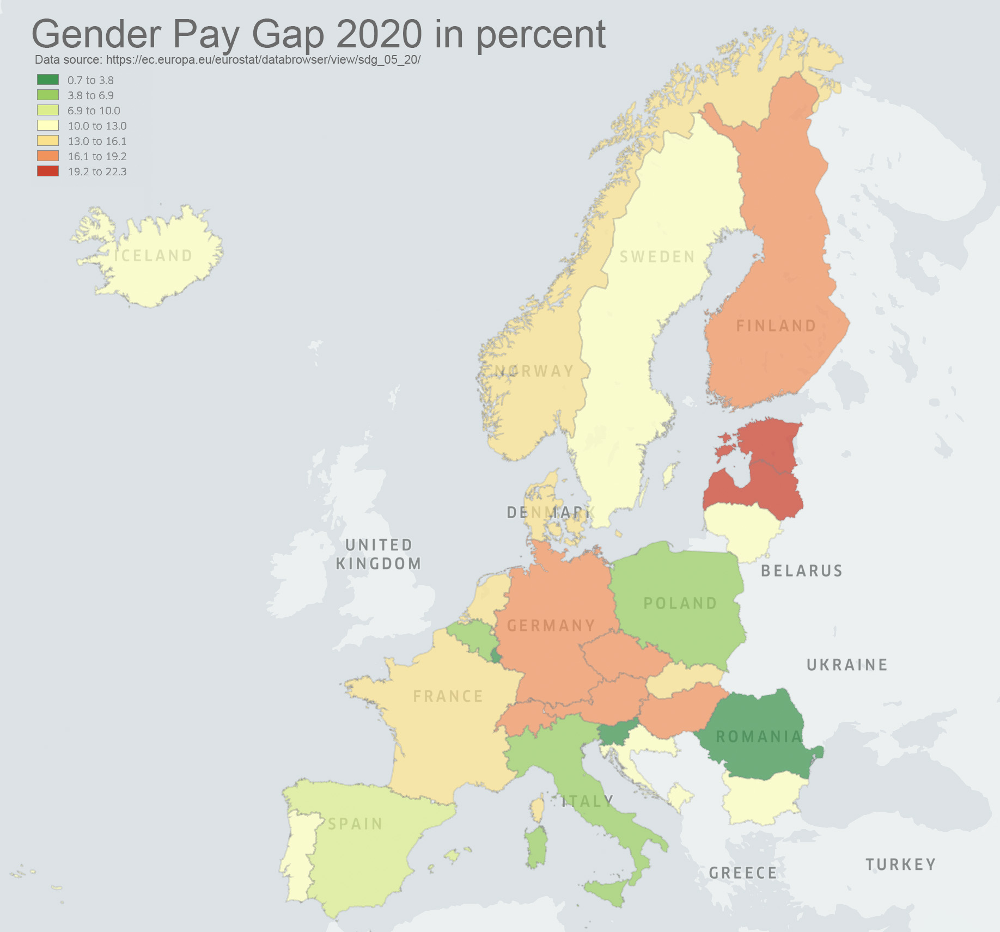
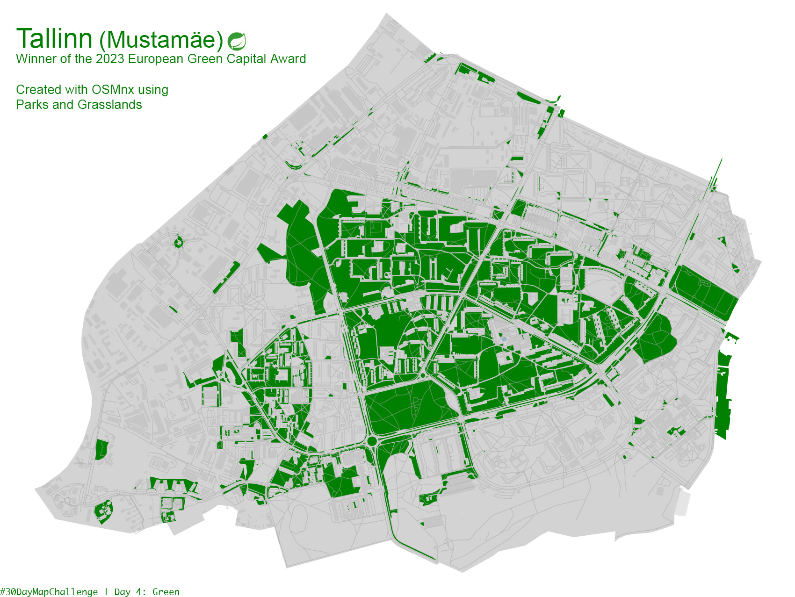
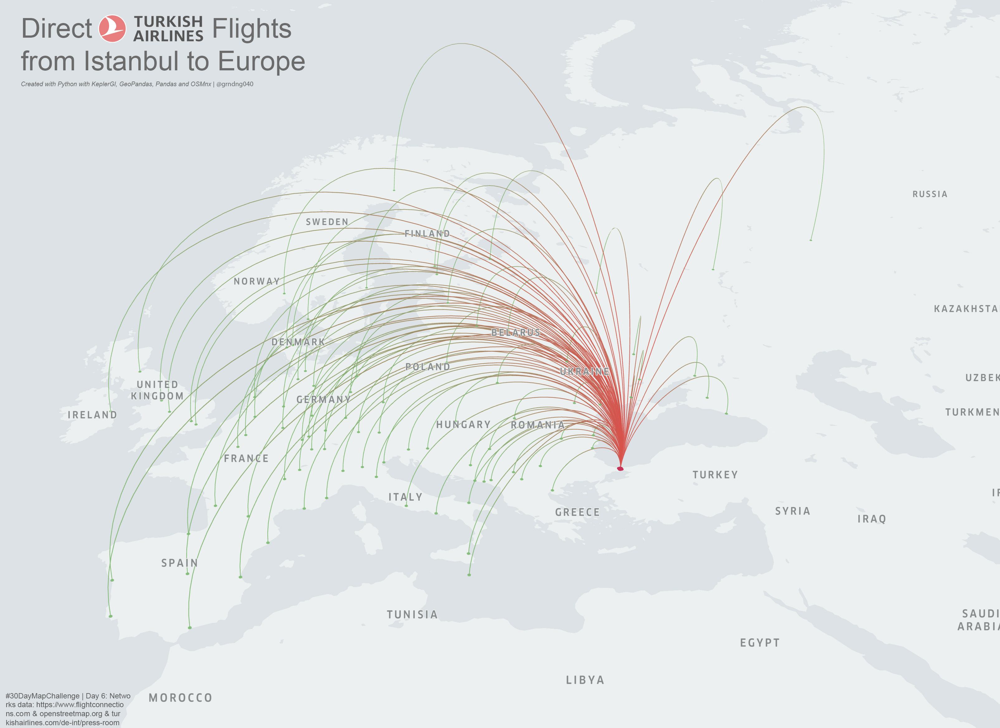
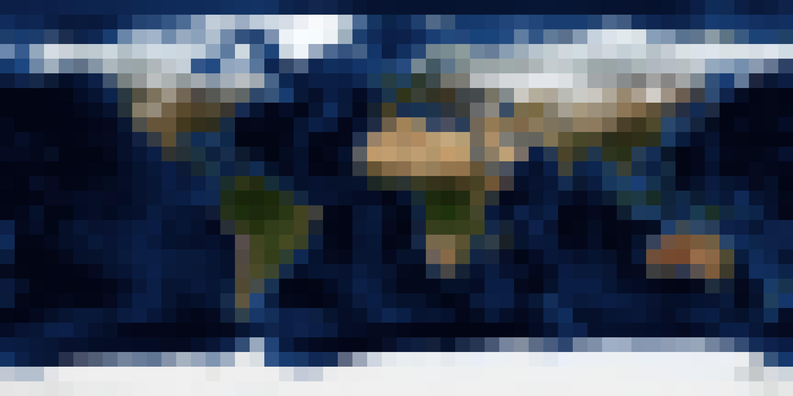
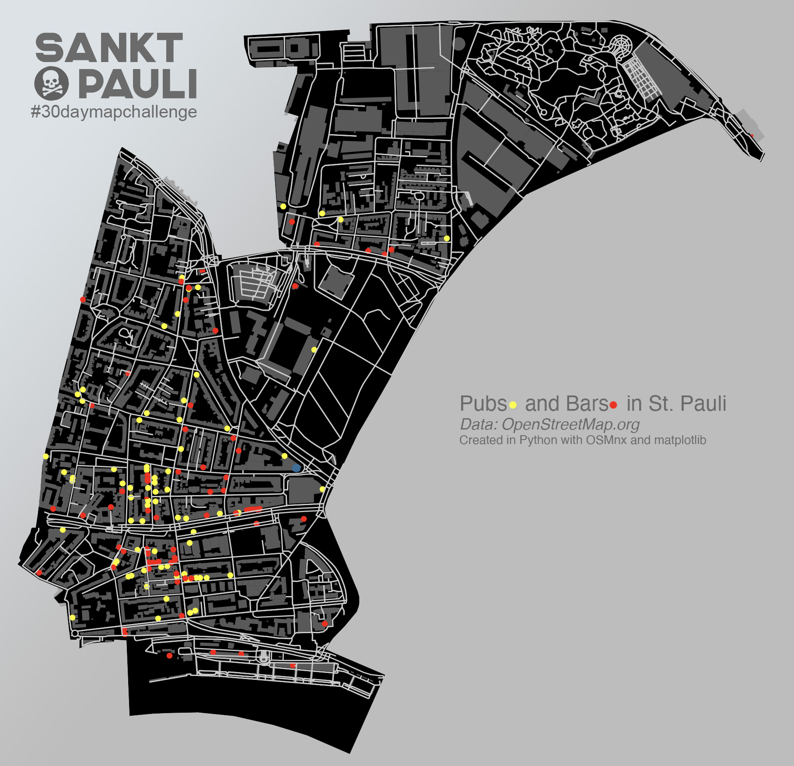

# 30 Day Map Challenge

## Day 01: Points
Libraries used: pandas | geopandas | shapely | keplergl

For the first day I wanted a quick win (spoiler: didn't work out) to stay motivated which didn't work out as intended. I wanted to show the difference of the centroid of France when considering the overseas areas in comparison to when considering only the mainland. The same applies to Hamburg to some degree due to an exclave called "Neuwerk" close to the North Sea.

  

Data source: Natural Earth Data (https://www.naturalearthdata.com/)

## Day 02: Lines
Libraries used: pandas | geopandas | altair

Inspired by the [US ZIPScribble Map](https://eagereyes.org/zipscribble-maps/united-states) I've looked for a way to replicate the same process to Germany. Mainly I wanted to see if regions will be as neatly divideable by ZIP codes in Germany as well. 

  

Data source: Launix (https://launix.de/launix/launix-gibt-plz-datenbank-frei/)

## Day 03: Polygons
Libraries used: geopandas | pandas | keplergl

A while back I've read an article about the Gender Pay Gap in Germany and how it's still a problem in most places. I also got some data for Germany but wanted to look at how Germany compares to other countries in the EU/Europe. I could get my hands on some data from the European Comission (Eurostat), combined the data with the corresponding areas and created a simple plot. Maybe I'll revisit this when doing interactive plots to show the difference of the Gender Pay Gap over time!

  

Data source: Eurostat (https://ec.europa.eu/eurostat/databrowser/view/sdg_05_20/default/table?lang=en) and GeoJSON Maps (https://geojson-maps.ash.ms/)

## Day 04: Colour Friday (Green)
Libraries used: osmnx | matplotlib

I was looking for the "greenest" city in Europe (how ever that might be determined) and stumbled upon the website of the European Commission which, each year, awards a city with the "European Green Capital Award". Next years winner is Tallinn, the capital of Estonia. Looking up Tallinn, I've seen quite some greenery in Mustamäe. Mustamäe translates to "Black Hill" which, in fact, looked pretty green from above which is why I decided to show it in todays map!

  

Data source: OpenStreetMap (https://www.openstreetmap.de/)

## Day 05: Ukraine
Libraries used: osmnx | matplotlib

For Day 05: Ukraine I was really undecided what to do without doing something obvious and might have ended up doing something obvious: Snake Island. Since I'm trying to solve all 30 days with Python, I thought it might be appropriate to do Snake Island or Zmiinyi Island.

  

Data source: OpenStreetMap (https://www.openstreetmap.de/), Icon8 (https://icon8.com)

## Day 06: Network
Libraries used: geopandas | pandas | osmnx | shapely | keplergl

I first wanted to compare "metro network length" to "city area" but found out that plotting water bodies with OSMnx isn't trivial so I've switched over to look at the destinations in Europe of Turkish Airlines flights from Istanbul. Just to find out that that's not as trivial as well. Anyways, here is the map for Day 6: Networks!

  

Data source: OpenStreetMap (https://openstreetmap.de/), FlightConnections (https://www.flightconnections.com/flights-from-istanbul-ist)

## Day 07: Raster
Libraries used: pillow (PIL fork)

Well, I guess this was my first five minute map for this challenge, there will be another one on another day. I didn't really have time so I went with a downsampling function I've written with pillow that gives your image a more "cubic" or obvious "raster"-like look. It's a simple function and in theory a good way to learn how down- and upsampling works.

  

Data source: NASA Blue Marble (https://visibleearth.nasa.gov/images/73909/december-blue-marble-next-generation-w-topography-and-bathymetry/73911l)

## Day 08: Data (Open Street Map)
Libraries used: osmnx | matplotlib

I've been using Open Street Map Data all the time accessing it with OSMnx so let's not change that. Todays map is showing St. Pauli (Sankt Pauli). St. Pauli is a quarter of the city of Hamburg and contains the red-light district around the Reeperbahn area. Besides that there are lots of bars and pubs which we are looking at today!

  

Data source: OpenStreetMap (https://openstreetmap.org/)

## Day 09: Space
Libraries used: 

## Day 10: A bad map
Libraries used: 

## Day 11: Colour Friday (Red)
Libraries used: 

## Day 12: Scale
Libraries used: 

## Day 13: 5 minute map
Libraries used: 

## Day 14: Hexagons
Libraries used: 

## Day 15: Food/drink
Libraries used: 
