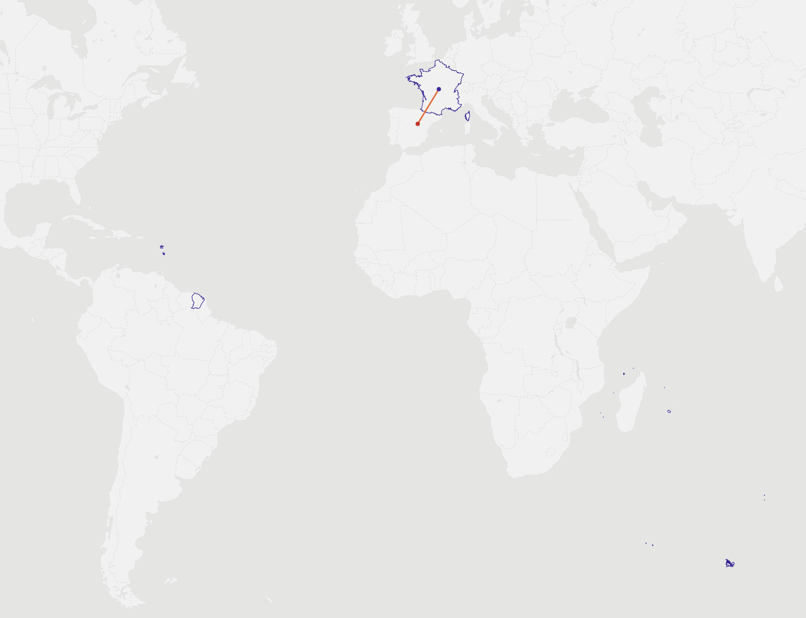
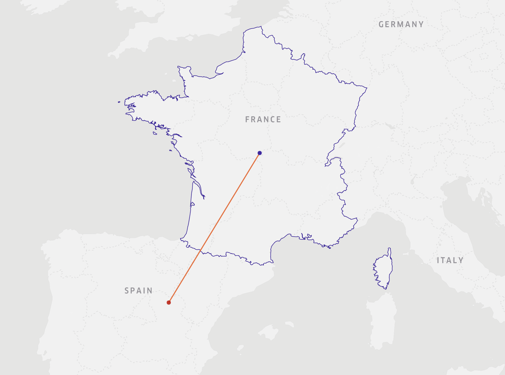

# 30 Days Map Challenge

## Day 01: Points
Libraries used: pandas | geopandas | shapely | keplergl

For the first day I wanted a quick win (spoiler: didn't work out) to stay motivated which didn't work out as intended. I wanted to show the difference of the centroid of France when considering the overseas areas in comparison to when considering only the mainland. The same applies to Hamburg to some degree due to an exclave called "Neuwerk" close to the North Sea.

  

  

Data source: Natural Earth Data

## Day 02: Lines
Libraries used: pandas | altair

Inspired by the US ZIPScribble Map (https://eagereyes.org/zipscribble-maps/united-states) I've looked for a way to replicate the same process to Germany. Mainly I wanted to see if regions will be as neatly divideable by ZIP codes only in Germany as well. 

Data source: ???

## Day 03: Polygons
Libraries used: 

## Day 04: Colour Friday (Green)
Libraries used: 

## Day 05: Ukraine
Libraries used: 

## Day 06: Network
Libraries used: 

## Day 07: Raster
Libraries used: 

## Day 08: Data (Open Street Map)
Libraries used: 

## Day 09: Space
Libraries used: 

## Day 10: A bad map
Libraries used: 

## Day 11: Colour Friday (Red)
Libraries used: 

## Day 12: Scale
Libraries used: 

## Day 13: 5 minute map
Libraries used: 

## Day 14: Hexagons
Libraries used: 

## Day 15: Food/drink
Libraries used: 
